# Hybrid Entra ID + On-Prem Active Directory + Microsoft 365 Integration Lab

## Overview
This project demonstrates a **complete hybrid identity deployment**, integrating:

- **On-Premises Active Directory (AD DS)**
- **Microsoft Entra ID (Azure AD)**
- **Microsoft 365 Business Standard**
- **Password Hash Sync (PHS) via Entra Cloud Sync**
- **Full identity lifecycle validation** across Outlook, SharePoint, Teams, and OneDrive

This lab mirrors real-world MSP onboarding workflows and modern enterprise identity environments.

---

## Skills Demonstrated
- **Hybrid Identity Architecture** (AD DS ↔ Entra ID)
- **Entra Cloud Sync (Password Hash Sync)**
- **Global Admin MFA enrollment & cloud security basics**
- **Microsoft 365 licensing & provisioning**
- **Exchange, SharePoint, Teams, and OneDrive activation**
- **Identity lifecycle validation from on-prem → cloud**
- **Troubleshooting sync, domain health, and provisioning**
- **Professional documentation & lab reporting**

---

# Lab Walkthrough

## **Phase 1 — Entra Tenant Setup & Security Hardening**

### **Step 1 — Created Microsoft Entra ID tenant and core users**
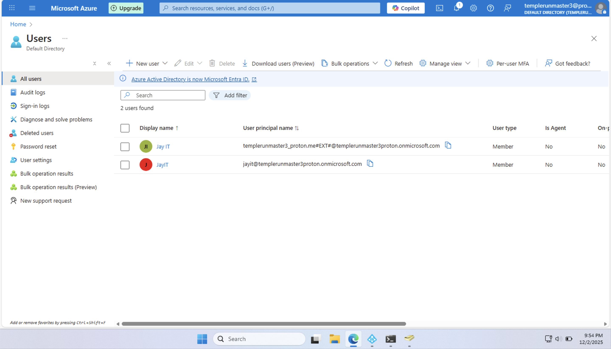

### **Step 2 — Enabled MFA for Global Admin using Microsoft Authenticator (iPhone)**
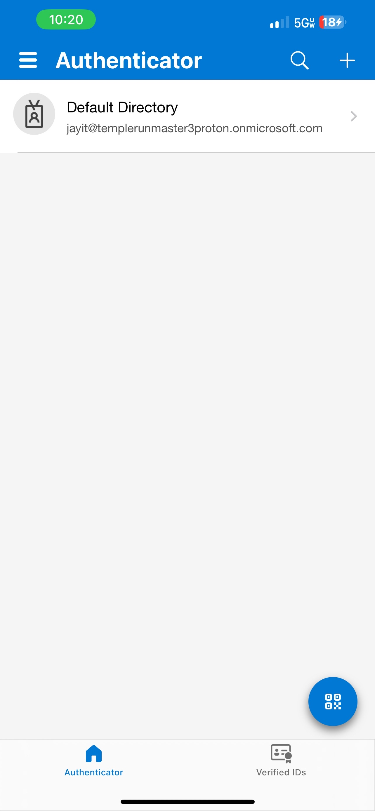

---

## **Phase 2 — Hybrid Identity Connection (On-Prem AD → Entra)**

### **Step 3 — Entered on-prem AD domain admin credentials in the Entra Provisioning Agent**
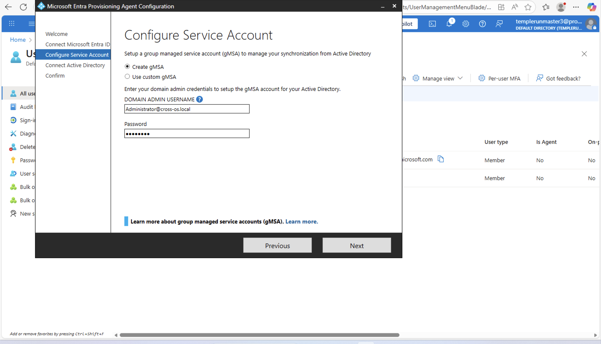

### **Step 4 — Connected on-prem Active Directory domain (`cross-os.local`) in the agent**
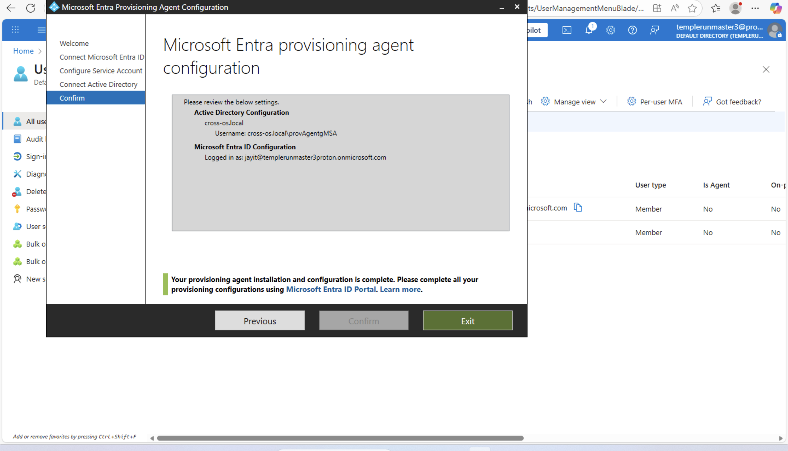

### **Step 5 — Created Cloud Sync configuration with Password Hash Sync enabled**
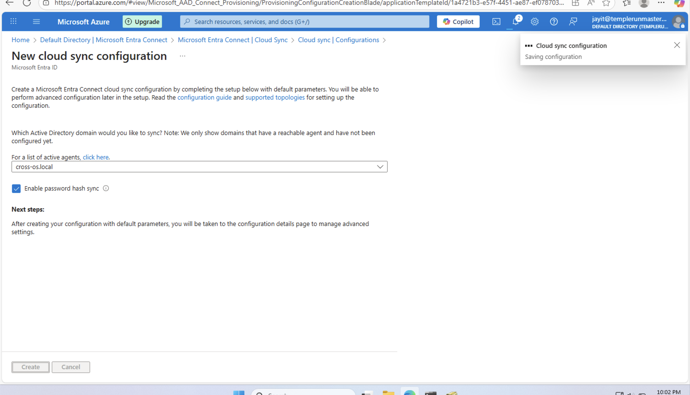

### **Step 6 — Cloud Sync configuration successfully activated**
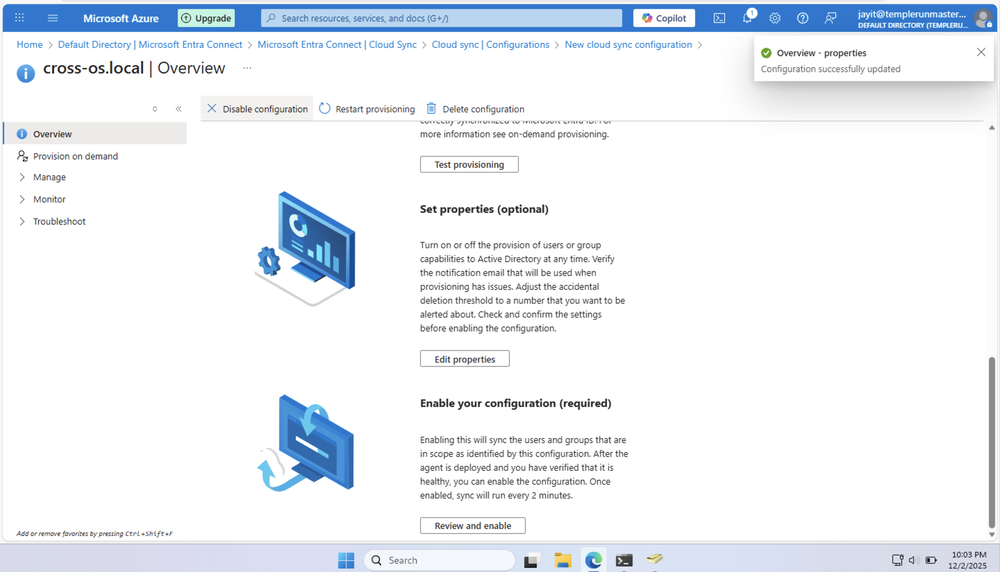

### **Step 7 — Verified domain health, sync status, and active provisioning agent**
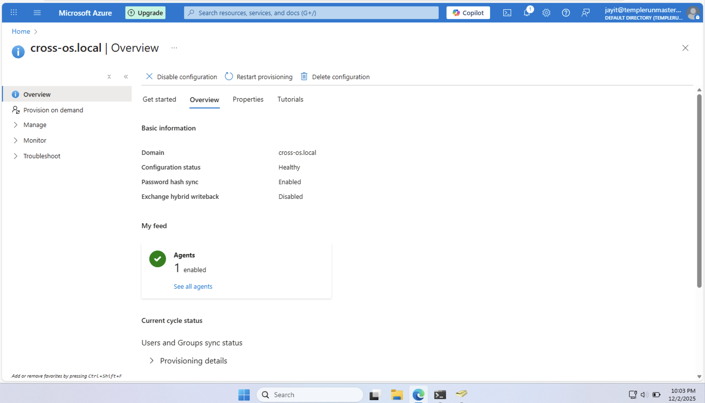

### **Step 8 — Confirmed on-prem AD users are synced into Entra ID**
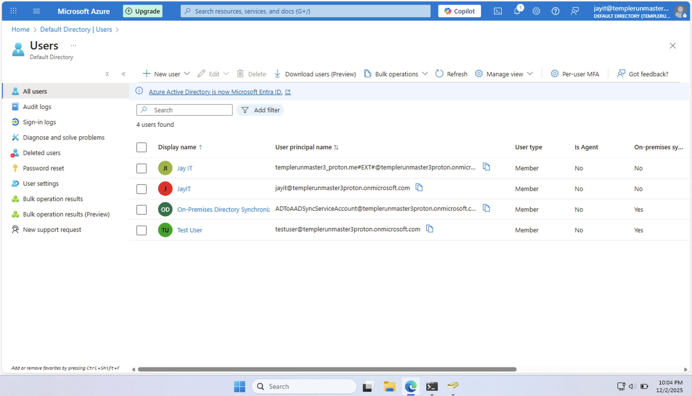

---

## **Phase 3 — Microsoft 365 Licensing & Identity Enablement**

### **Step 9 — Assigned Microsoft 365 Business Standard license**
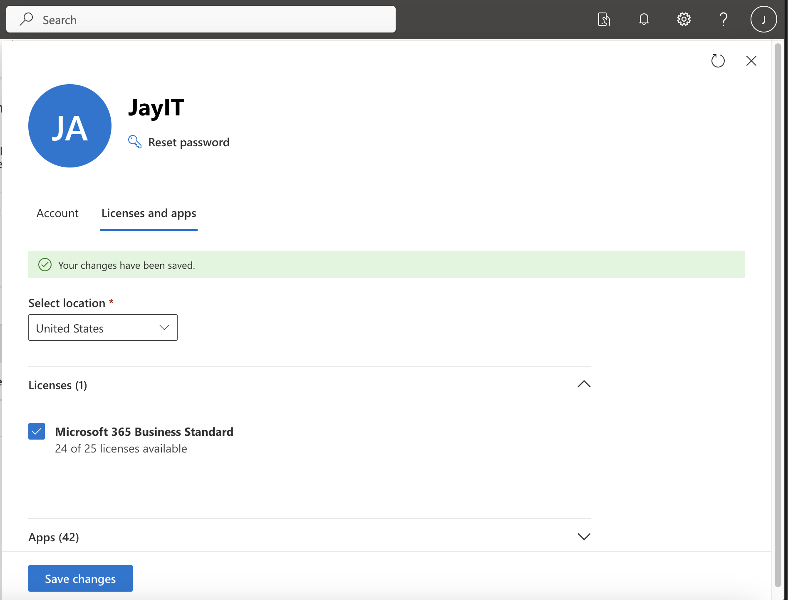

### **Step 10 — Assigned Microsoft Entra Suite license**
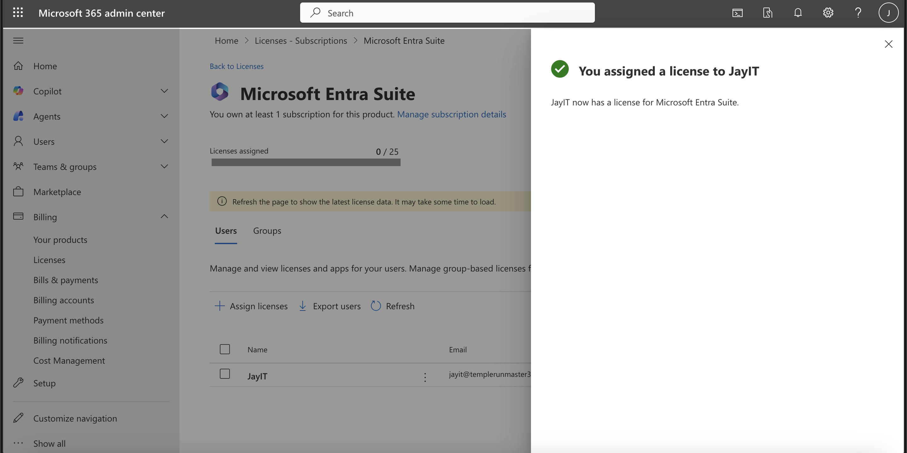

### **Step 11 — Confirmed Test User has both M365 and Entra Suite licenses**
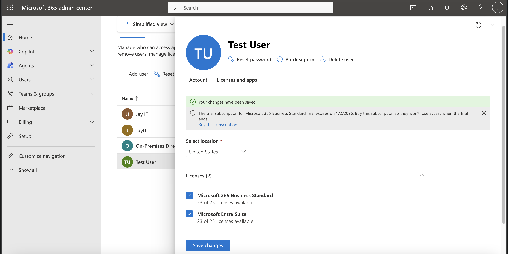

---

## **Phase 4 — Full Cloud Identity Lifecycle Validation**

### **Step 12 — Logged into Microsoft 365 portal with synced on-prem Test User**
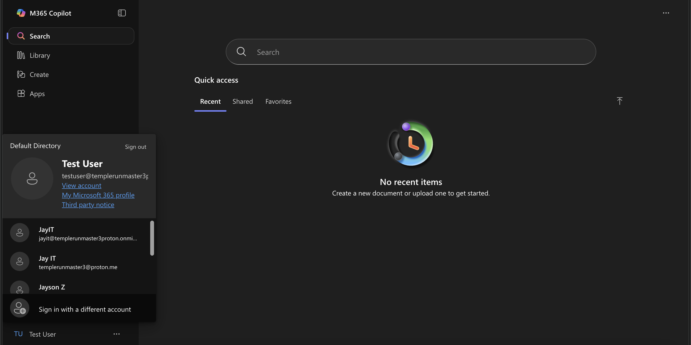

### **Step 13 — Exchange Online mailbox automatically provisioned (Outlook on the web)**
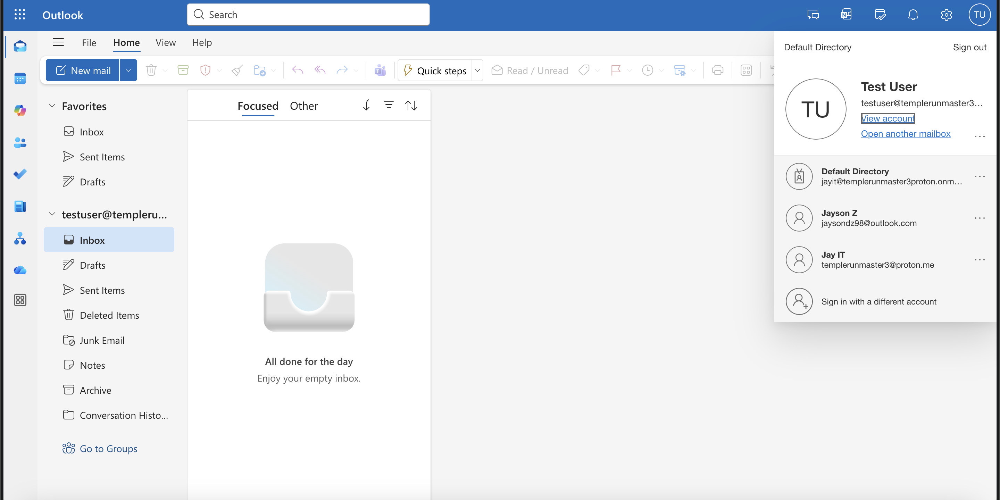

### **Step 14 — SharePoint Online access verified**

### **Step 15 — Microsoft Teams login & provisioning successful**
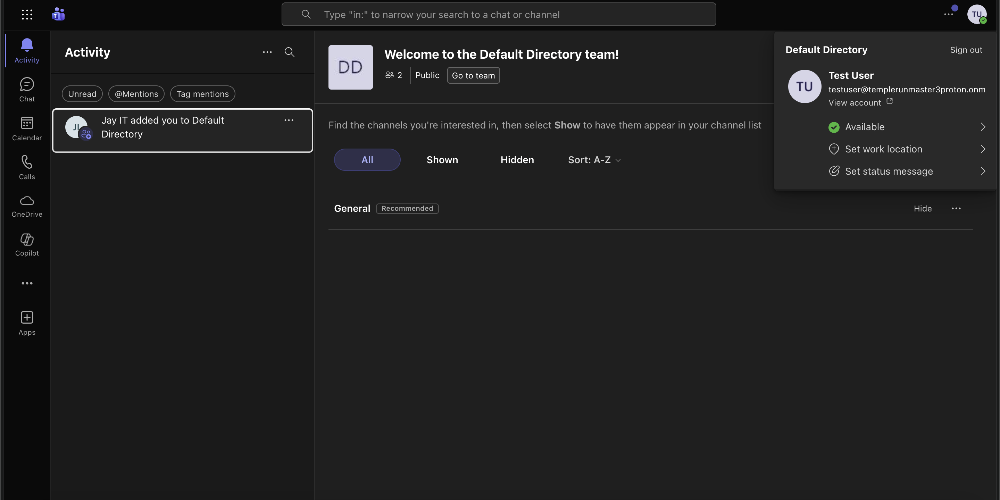

### **Step 16 — OneDrive for Business successfully provisioned**
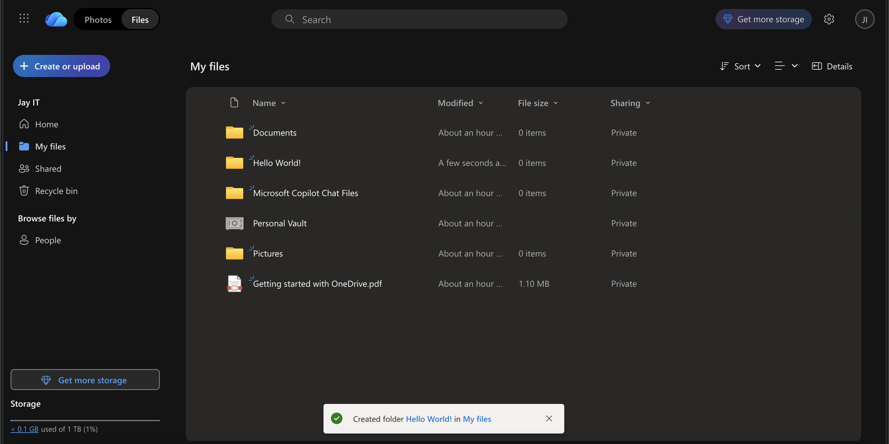

---

# Key Takeaways
This project provided a **complete, end-to-end demonstration** of a modern hybrid identity environment:

- Local AD synchronized with Microsoft Entra ID  
- Secure MFA-enabled cloud authentication  
- Fully working Microsoft 365 services (Outlook, Teams, SharePoint, OneDrive)  
- Real MSP-style user onboarding workflow  
- Demonstrates understanding of both **on-prem** and **cloud identity systems**  

This lab reflects real-world identity engineering and is directly applicable to **Help Desk, System Administrator, MSP, Cloud Engineer, and Security roles**.
